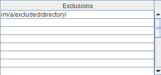
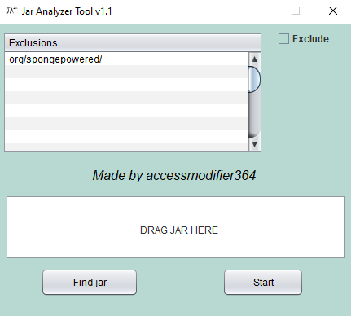
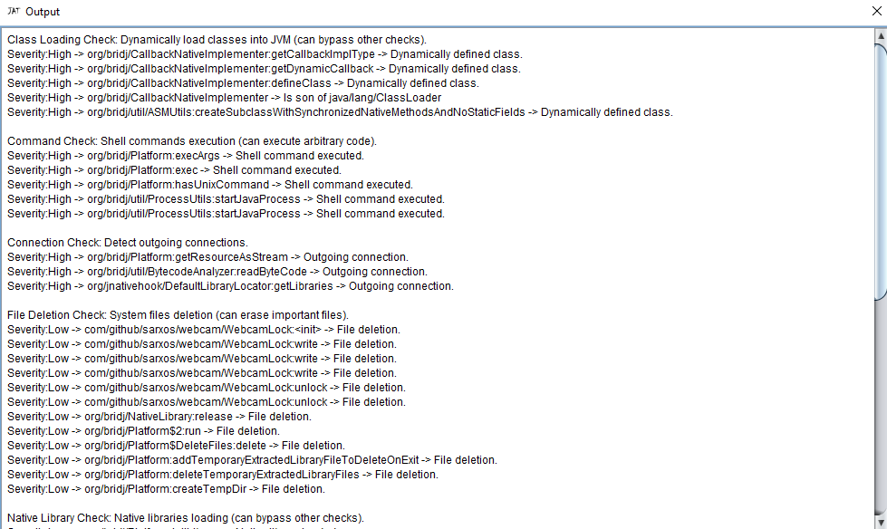

# Jar Analyzer Tool

> An easy-to-use tool to scan classes inside jar files.

## Introduction

This tool has only one objective, avoid executing malware made in Java, it will analyze every class inside a `.jar`
or `.zip` file.

## Checks

- ClassLoadingCheck: Search for ClassLoaders, and MethodInsnNode instructions which call `defineClass()`
  or `Unsafe.defineAnonymousClass()`.
- CommandCheck: Search for MethodInsnNode instructions which call `Runtime.exec()`, `ProcessBuilder.command()`
  or `ProcessBuilder.<init>`.
- ConnectionCheck: Search for LocalVariableNode which contains `java/net/URLConnection`, `java/net/HttpURLConnection`
  , `java/net/Socket`, `etc` and MethodInsnNode instructions which call `URL.openConnection()` or `URL.openStream()`.
- FileDeletionCheck: Search for MethodInsnNode instructions which call `File.delete()`, `File.deleteOnExit()`
  , `Files:deleteIfExists`, `etc`.
- NativeLibraryCheck: Search for MethodInsnNode instructions which call `System.load()`, `Native.loadLibrary()`,
  and `others`.
- ReflectionCheck:  Search for MethodInsnNode instructions which call `Class.getDeclaredField()`
  or `Class.getDeclaredMethod()`.
- URLCheck: Search for valid `java/net/URL` inside fields, local variables and valid `java/lang/String` which are URIs.

## Exclusions

> 1.- Enable the `Exclude` checkbox. 

> 2.- If you add `im/a/excluded/directory/` to the exclusions table, every class inside that package will be ignored. 
 

Note: Add the exclusions before importing the jar!

## Usage

Download the latest [release](https://github.com/accessmodifier364/JarAnalyzerTool/releases/).
> 1.- Drag the jar file to the box. 

> 2.- Press the `Start` button. 

> 3.- Read the results in the new dialog. 
